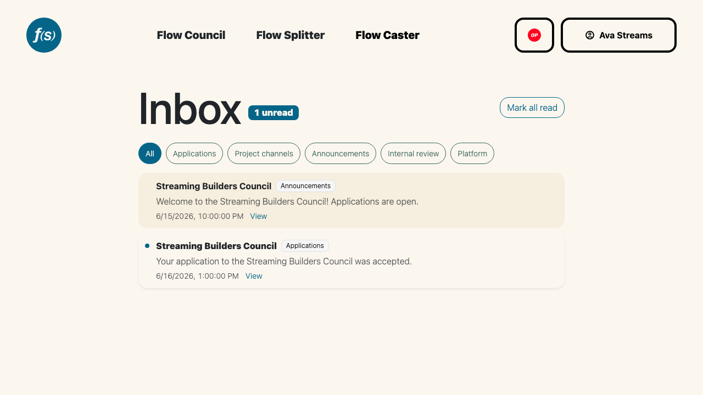

# Inbox

The **Inbox** at [`flowstate.network/inbox`](https://flowstate.network/inbox) collects every notification tied to your wallet in one place. Connect your wallet and **Sign In With Ethereum** to view it.

*The inbox with category filters.*

## Categories

Items are tagged by category, and you can filter the list with the pills at the top:

- **Applications** — application and eligibility updates.
- **Project channels** — messages in your projects' channels.
- **Announcements** — round announcements.
- **Internal review** — review comments on your applications.
- **Platform** — Flow State platform messages.

Select **All** to see everything, or a single category to narrow the view.

## Reading items

Unread items are highlighted and counted by the **unread** badge in the header. Click an item to mark it read; many items include a **View** link that opens the related round channel, announcement, or review. Use **Mark all read** to clear the unread count in one step, and **Load older** to page back through your history.

:::tip
Want these in your inbox by email too? Add an email and toggle the categories you care about under [Email Notifications](003-notifications.md).
:::
