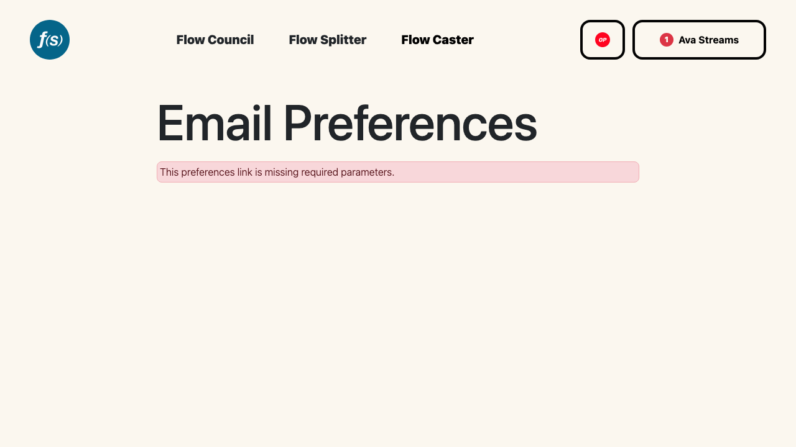

# Email Notifications

Flow State can email you when there's activity tied to your wallet — application updates, channel messages, announcements, and more. Email is **optional** and off until you opt in.

## Turning on email

Add an **Email** in the Contact Information section of your [Profile](001-profile.md). Once an email is set, you can check the consent box to enable notifications and then toggle which types you want.

## Notification types

You can toggle each of these on or off:

- **Application & eligibility updates**
- **Project channel messages**
- **Round announcements**
- **Internal review comments**
- **Flow State Platform updates**

The toggles are disabled until you've added an email and given consent.

## Managing preferences and unsubscribing

*Email notification preferences.*

Every Flow State email includes a preferences link to the `/preferences` page. Opening it from the email link lets you adjust the same notification toggles without signing in, and offers a one-click **Unsubscribe from all** that turns off every type at once.

:::note
If your email starts bouncing, Flow State suspends delivery and shows a warning. Update your email in your profile to resume notifications.
:::
