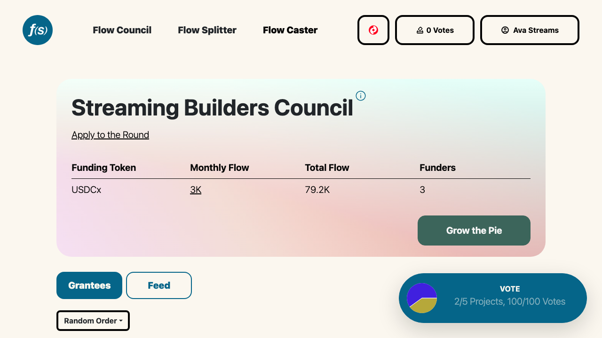

# Flow Councils
**_Continuous, participatory funding allocation._**

## Overview
**Flow Councils** are a tool for continuous, participatory funding allocation. **Council Members** vote to split a stream of money across an arbitrary number of recipients. 

*A Flow Council page with its funding stream and grantees.*

Flow Councils enable real-time (re)allocation of budgets based on new information, evolving priorities, and demonstrated results. The streaming structure offers adaptability and efficiency for allocators; for recipients, capital velocity and budget predictability.

Flow Councils are a great tool for grants programs, organizational budgeting, and any collective allocation process to become more dynamic and effective.

You can launch a Flow Council yourself with the no-code [launchpad](https://flowstate.network/flow-councils/launch), or reach out to us on [Telegram](https://t.me/flowstatecoop) if you'd like a hand getting started.

The docs are split by role:

- **[Running a Round](operators/index.md)** — the step-by-step operator guide: launch, permissions, applications & review, membership, funding, and communications.
- **[Participating](participants/index.md)** — applying for funding, voting, receiving streams, and growing the pie.

:::info[What is streaming money?]
Check out the [Superfluid Docs](https://docs.superfluid.finance/docs/concepts/superfluid) to learn more about [streaming money](https://docs.superfluid.finance/docs/concepts/overview/money-streaming), [Super Tokens](https://docs.superfluid.finance/docs/concepts/overview/super-tokens), [distribution pools](https://docs.superfluid.finance/docs/concepts/overview/distributions), and other protocol foundations. 
:::
