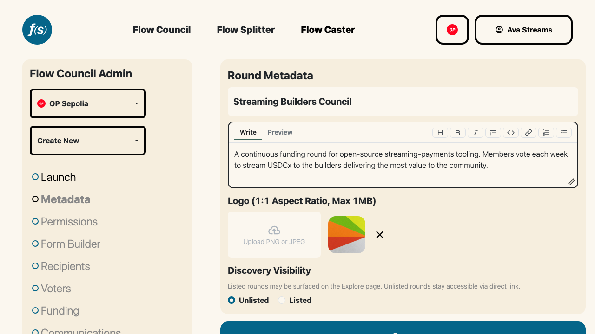

# Launch

You can deploy a Flow Council yourself—no code required—from the
[launchpad](https://flowstate.network/flow-councils/launch). Flow Councils are
available on Arbitrum One, Base, Celo, and OP Mainnet.

Each Flow Council is configured to distribute a single
[Superfluid Super Token](https://docs.superfluid.org/docs/concepts/overview/super-tokens).
Flow State natively supports many popular Super Tokens, but also allows
deployers to set any
[valid Super Token contract address](https://explorer.superfluid.org/arbitrum-one/supertokens)
as the distribution currency. Once deployed, this token selection cannot be
changed.

Launching a council also deploys a **SuperApp Splitter**—the contract incoming
funding streams route through. After launch, operators manage the round's
funding from the [Funding](005-funding.md) page: sponsoring the funding stream,
topping up the splitter, and scheduling or closing the round. Anyone can add to
the funding anytime by [Growing the Pie](../participants/004-grow-the-pie.md).

By default, Flow Councils are open-ended. On councils with a splitter, operators
can schedule a round end date from the [Funding](005-funding.md) page—once it
passes, the round stops accepting incoming streams.

From the **Metadata** page, operators set the round's public name and
description and choose whether it is **Listed** (surfaced on public discovery
pages) or **Unlisted** (fully functional, reachable by direct link). New rounds
default to Unlisted.

*Setting the round name, description, and visibility.*

## Permissions

The deploying address is set as the Flow Council **Super Admin** by default.
From the **Permissions** page, a Super Admin can grant any address one or more
roles:

- **Super Admin** — full control, including managing other admins and every
  setting below.
- **Voter Review** — manages Council membership and voter groups.
- **Recipient Review** — reviews applications and manages the recipients in the
  distribution pool.

Once a voting policy has been set and recipients have been added to the Flow
Council, a Super Admin can remove themselves and all other admins to make the
configuration immutable. See [Permissions](002-permissions.md) for details.
