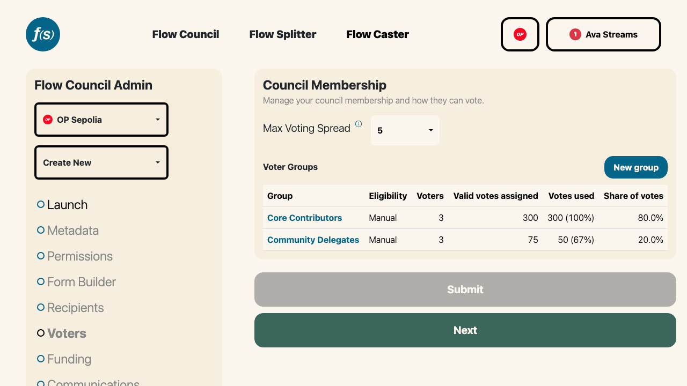
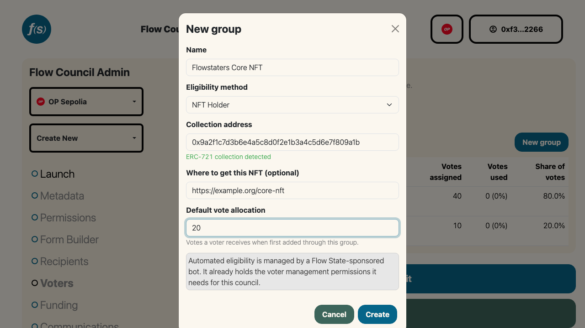

# Council Membership
A **Council** is the set of wallet addresses that may cast votes in a Flow Council round. The round administrator defines a **voting policy** when a round is created:

1. **Who can vote** – a member list of Ethereum addresses
2. **Vote budgets** – the maximum number of votes each member can cast—set individually or globally
3. **Max Vote Spread** – an optional rule that caps how many distinct recipients a voter may support, encouraging more focused allocations

Council admins (and anyone granted the **Voter Review** role) can update membership and the voting policy anytime from the **Membership** page of the Flow Council launchpad. All membership changes are written onchain; large updates are submitted in batches.

## Voter Groups

*Voter groups and their share of votes.*

Membership is organized into **voter groups**. Each group has an **eligibility method** that determines how addresses join it, and a **default vote allocation** applied to members as they're added. A council can have several groups (for example, a curated core team alongside an open community group).

### Manual groups
A **manual** group is a list you curate by hand. Add voters by pasting addresses (one per line) or uploading a CSV in the **Add voters** modal, and set each member's vote budget—either per-address or all at once. Remove a voter and they lose their onchain votes.

### GoodDollar groups (Celo only)
A **GoodDollar** group lets verified [GoodDollar](https://www.gooddollar.org/) identities **self-claim** their spot on the Council—no admin action needed per voter. New claimants are automatically added with the group's default vote allocation.

Because adding voters happens automatically, a Flow State–sponsored bot needs permission to manage membership. When you create a GoodDollar group, you'll be prompted to grant that bot the **Voter Review** role in a single transaction. Self-claim works only while the bot holds that role, so revoking it is the kill switch for automated eligibility. GoodDollar groups are available only on **Celo**.

A council uses one automated method or the other: a council with a GoodDollar group can't add an [NFT Holder](#nft-holder-groups) group, and vice versa.

### NFT Holder groups
An **NFT Holder** group lets anyone holding a given NFT **self-claim** their spot on the Council. You point the group at a collection; holders claim their own votes, and no admin touches a list.

*Creating an NFT Holder group: paste the collection address, and the token standard is detected for you.*

**Setup**

1. On the **Membership** page, click **New group** and select **NFT Holder** as the eligibility method.
2. Paste the collection's **contract address**. It must be deployed on the same network as the council.
3. The standard is detected automatically: you'll see **ERC-721 collection detected** or **ERC-1155 collection detected**. For an ERC-1155, a required **Token ID** field appears, since a 1155 contract holds many tokens and only one of them counts.
4. Optionally add **Where to get this NFT**, a mint page or marketplace link. Voters who don't hold the NFT see it as a **Get this NFT** link in the eligibility popup.
5. Set the **Default vote allocation**, the number of votes a holder receives. The group name defaults to the detected collection name (or a shortened contract address when the contract exposes no name); edit it freely, it's what voters see.
6. Click **Create**. Like GoodDollar groups, an NFT group needs the Flow State–sponsored bot to hold the **Voter Review** role, so the first NFT (or GoodDollar) group on a council triggers a one-time grant transaction.

**Tiering with several groups**

A council can have **several** NFT groups, which is how you tier membership: a core contributor NFT worth 20 votes alongside a community NFT worth 5. When a wallet holds NFTs matching more than one group, it receives the **highest single allocation**, never the sum, and lands in exactly one group. Ties go to the group created first.

Two groups on the same council can't point at the same collection and token ID, so tiering happens across **distinct collections** (or distinct token IDs within one ERC-1155).

**Editing**

The contract address, token ID, vote allocation, name, and link can be changed at any time, including after the group has members. Changing the address or token ID shows a warning, because **existing members keep the votes they already have and are not re-checked**: use the voter table to remove anyone who no longer qualifies. The eligibility **method** is locked once the group has members.

**Constraints**

- A council uses **one** automated method or the other: **GoodDollar and NFT Holder cannot coexist** on the same council. Whichever you configure first disables the other in the eligibility dropdown, with the reason shown inline.
- The collection must be on the council's chain. Cross-chain gating is not supported.
- Holding one NFT is the same as holding fifty. There are no balance thresholds and votes don't scale with the number held.
- Holders claim their own votes. There's no way to bulk-import everyone who holds a collection.

:::note[Votes persist after a transfer]
Eligibility is a gate at entry, not an ongoing condition. Selling or transferring the NFT does **not** revoke voting power that was already granted. To remove someone, zero out their votes in the voter table.
:::

:::tip[A contract that doesn't advertise its standard]
A few older collections don't expose their standard in a machine-readable way. When detection is inconclusive you can pick **ERC-721** or **ERC-1155** yourself, and the contract is still structurally verified before it's accepted, so an ordinary token contract can never be saved as a collection ("This looks like a token contract, not an NFT collection").
:::

For the voter's side of this, see [Voting](../participants/002-voting.md#claiming-votes-as-an-nft-holder). For the endpoints, the claim signature, and the refusal codes, see [NFT Eligibility API](../../../developers/006-nft-eligibility-api.md) in the developer docs.

### Metrics groups
A **metrics group** delegates a configurable share of a council's allocation to an automated data-driven policy. It adds the **F(S) Automation Bot** as a plain on-chain voter with an admin-set voting power equal to the share you want the policy to control. The bot requires no special role; it only casts its own ballot.

An external caller (a Dune query, cron job, or any HTTP client) then pushes allocation decisions by POSTing **relative weights** to an authenticated endpoint using a per-council **API key**. The platform normalizes those weights to the bot's current on-chain voting power and submits the ballot on-chain. Scoring and ranking logic live entirely in the caller; the platform ingests the weights and handles the on-chain mechanics.

**When to use it:** when you want part of the council's allocation to follow an objective, automatable signal, for example onchain activity metrics, contribution data from a dashboard, or any policy you can express as a ranked list of recipients.

**Setup**

1. On the **Membership** page, click **New group** and select **Metrics** as the eligibility method.
2. Set the **Vote power** (the total number of votes the bot can spread across recipients). This is the share of the council's allocation controlled by the automated policy.
3. Click **Create**. One wallet transaction adds the bot as a voter with that voting power.
4. Open the group detail page. In the **Metrics API** panel, enter a label and click **Create key**. Copy the token immediately. It is shown **once** and not stored in plaintext.

**Key management**

The Metrics API panel lists all keys for the council, identified by label and a short prefix. Keys show their last-used date. To deactivate automated voting, click **Revoke** next to any key. Revoked keys are rejected immediately and cannot be reinstated. Mint a new key to resume.

**Editing vote power**

To change the share of the allocation the bot controls, open the group detail, click the edit icon, update **Vote power**, and click **Save**. Changing vote power submits an on-chain transaction.

**Constraints**

- A council may have **at most one** metrics group.
- The eligibility method of a metrics group is locked after creation.
- The bot needs no role beyond being a voter; no role grant is required during setup.

For the request format and response codes, see [Metrics API](../../../developers/005-metrics-api.md) in the developer docs.

:::tip[Single membership]
An address belongs to **one** group per council. Adding an address that already votes in another group of the same council is skipped rather than duplicated.
:::
