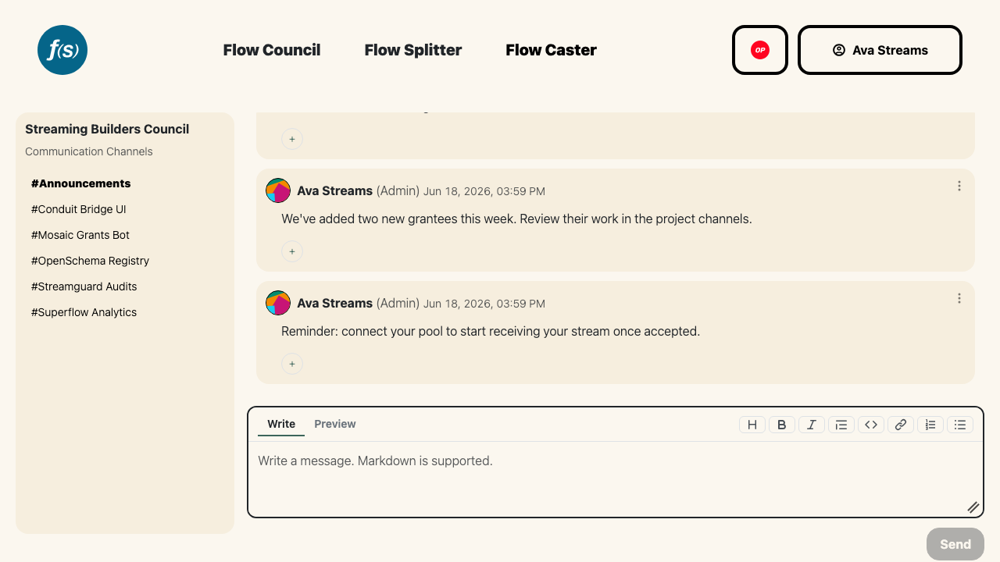

# Communications
Every Flow Council has built-in chat so operators and projects can stay in sync without leaving the platform. Open it from the **Communications** page of the launchpad.

*Per-round and per-project channels with a markdown composer.*

There are two kinds of channels:

- **Announcements** – a council-wide channel for broadcasting updates to everyone in the round. Council admins post here; all members can read it.
- **Project channels** – one private channel per project, shared between the project's team and the council's admins.

Pick a channel from the sidebar to start reading. Sign in with your wallet to participate—you'll only see the channels you have access to.

## Sending messages
Type into the message box and send. **Markdown is supported**, so you can format updates with headings, lists, and links. You can edit or delete your own messages afterward.

## Pinning
Admins can **pin** a message to keep important context at the top of a channel—handy for round timelines, links, or recurring instructions. Pinning and unpinning are moderator actions; pinned messages are flagged so everyone can spot them.

## Reactions
React to any message with an emoji. The reaction set is fixed—a small, curated list rather than a full picker:

👍 ❤️ 🎉 🙌 🌊 🦫

Click an emoji to add your reaction; click it again to remove it.
