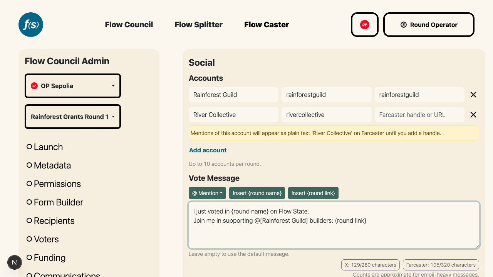
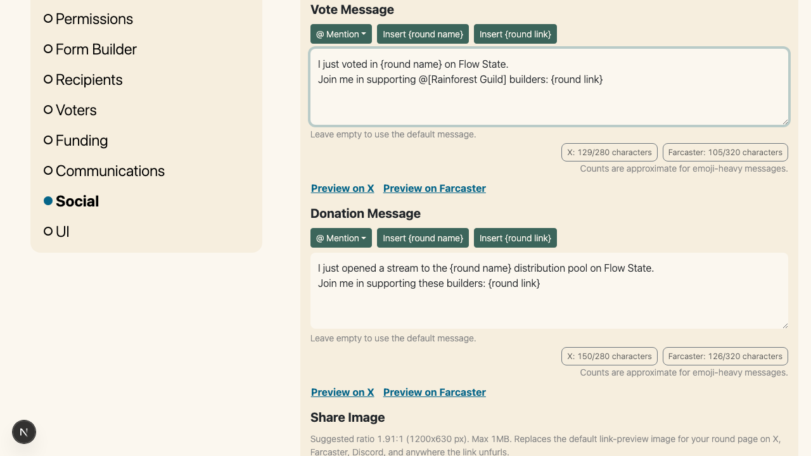
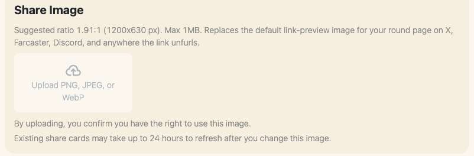

# Social

When a Council Member submits a ballot or a funder opens a stream, the success screen offers **Post to X** and **Cast to Farcaster** buttons. By default those posts use a generic Flow State message and the site-default link-preview image. From the **Social** page of the launchpad (between **Communications** and **UI**), round operators put their own campaign language, team @handles, and artwork into that moment.

*Accounts with per-platform X and Farcaster handles, and the vote message editor below.*

Everything on this page is optional. A round that never touches it keeps the default share messages and image, and saving uses the same round-admin authorization as the other launchpad pages.

## Accounts

Define up to 10 named accounts (your team, co-sponsors, partners) that can be @mentioned in the share messages. Each account has a display name plus an **X handle** and a **Farcaster handle**, since teams often use different handles per platform. Paste a full profile URL or a bare handle into either field; it's normalized to the bare handle when you leave the field.

An account can have just one platform's handle. Mentions of it then fall back to the account name as plain text (no @) on the other platform, and the editor warns you about this at configuration time.

## Share messages

There are two messages, each a single template used on both platforms:

- **Vote Message** – shown after a Council Member submits a ballot.
- **Donation Message** – shown after a funder opens a stream to the distribution pool ([Grow the Pie](../participants/004-grow-the-pie.md)).

Both editors are pre-filled with the default messages, so you edit rather than start from scratch. Clearing a message entirely reverts that action to the default message.

Messages are plain text with three tokens, inserted from the toolbar above the editor (for mentions, you can also just type `@` and pick an account):

- `@[Account Name]` – resolves to the account's handle on whichever platform the post is drafted for. Tokens are references, not pasted text: rename an account or edit its handles later and every future post picks up the change automatically.
- `{round name}` – the round's public name from the [Metadata](001-launch.md) page. If the round has no name yet, the token resolves to nothing and the editor warns you.
- `{round link}` – the public round page URL, included by default at the end of each message. On X the link appears in the post text; on Farcaster it's attached as an embed so it renders as a card. You can delete the token, but then posts won't link back to your round and won't show the share image card (the editor warns).

*Each editor shows live X and Farcaster character counts and preview buttons.*

### Character limits

Each editor shows the *effective* post length per platform: X allows 280 characters and counts any link as a fixed 23, while Farcaster allows 320 and excludes the link entirely because it travels as an embed. Counts are approximate for emoji-heavy messages. **Save** is blocked while either message exceeds either platform's limit, with the offending message and platform named.

### Preview

**Preview on X** and **Preview on Farcaster** open that platform's real compose screen with your current editor content, even before saving, with mentions and the round link resolved exactly as a voter or funder would get them. Nothing is posted unless you post the draft yourself.

## Share image

Upload an image to replace the default link-preview (OpenGraph) image for your round page. It appears wherever the round URL unfurls into a card: below the post text on X, as the embed card on Farcaster, and in link previews on Discord, Telegram, Slack, and similar apps.

*The share image uploader and its helper notes.*

- **PNG, JPEG, or WebP**, max **1MB**, suggested ratio **1.91:1** (1200x630 px).
- By uploading, you confirm you have the right to use the image.
- Replacing the image takes effect on the round page immediately, but platforms cache link cards, so existing share cards may take up to 24 hours to refresh.

Remove the image and the round page goes back to the site-default preview image.

## What voters and funders see

After a successful vote or stream checkout, the success screen shows **Post to X** and **Cast to Farcaster**. Clicking either opens that platform's compose screen pre-filled with your message, mentions resolved to that platform's handles, and the round link rendering your share image as its card. The previous "Post on Lens" option has been removed from both surfaces.
