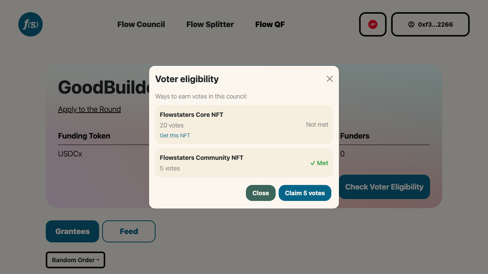

# Voting
Flow Councils are dynamic. They empower voters to incorporate new information and evolving preferences for more efficient resource allocation.

Every time a vote is (re)cast, funding flows will adapt.

`payout_rate = (recipient votes / total votes) × funding stream`

Council votes are cast in ballots. Council Members review grantee information, add their favorites to a ballot, allocate whole votes (up to their voting budgets and spread max), and then submit with a single transaction. Voters can edit and recast their ballot anytime.

For many rounds, we'll sponsor network transaction fees. While Flow QF uses out-of-pocket spending as *the signal* for preference, Flow Councils are designed to be maximally accessible both conceptually and financially.  

After your ballot is submitted, you can spread the word with **Post to X** and **Cast to Farcaster**, which open a pre-filled draft in that platform's composer. Round operators can customize the message and its link preview from the [Social](../operators/007-social.md) page.

## Claiming votes as an NFT holder

Some councils grant votes to holders of a membership NFT. On those rounds, **Check Voter Eligibility** opens a panel listing every way to earn votes in that council, what each is worth, and whether your connected wallet qualifies right now.

*The eligibility popup: one requirement met, one not met with a link to get the NFT.*

- **Checking costs nothing.** Requirements are read straight from the chain when the panel opens. No transaction, no gas, no wallet approval.
- **Requirements you don't meet** show a **Get this NFT** link when the round operator provided one.
- **Claiming is always a deliberate click.** The claim button names the exact number of votes you'll receive ("Claim 5 votes"). Selecting it asks you to sign a short message. The signature is free, it isn't a sign-in, and it creates no session; it only proves you control the wallet. Flow State then assigns your votes on-chain and pays the transaction fee.
- **No wallet connected?** The requirements and their allocations still render, with a **Connect Wallet** button in place of the per-requirement status.
- **You receive the largest single allocation you qualify for**, not the sum. If you hold two qualifying NFTs worth 20 and 5 votes, you get 20.
- **Already have votes?** The panel simply shows how many and takes you to your ballot. Automated checks never change a wallet that already has voting power.

Your votes stay with you: selling or transferring the NFT afterwards does not take them away.

If a claim doesn't go through, the message tells you which case you're in:

| Message | What it means |
|---|---|
| Try again in a moment | Claims on this council are briefly throttled. Nothing failed; retry shortly. |
| Couldn't check right now | A chain read didn't return. This is never a verdict on your holdings; retry the row. |
| This wallet doesn't meet any of the requirements yet | No qualifying NFT was found in the connected wallet. |
| This council's setup is incomplete | The round operator hasn't granted Flow State permission to add voters. Contact them. |
| The transaction didn't go through | Nothing was granted and nothing was recorded. Claim again. |

Declining the signature does nothing at all: no votes are granted and the claim button stays available.

