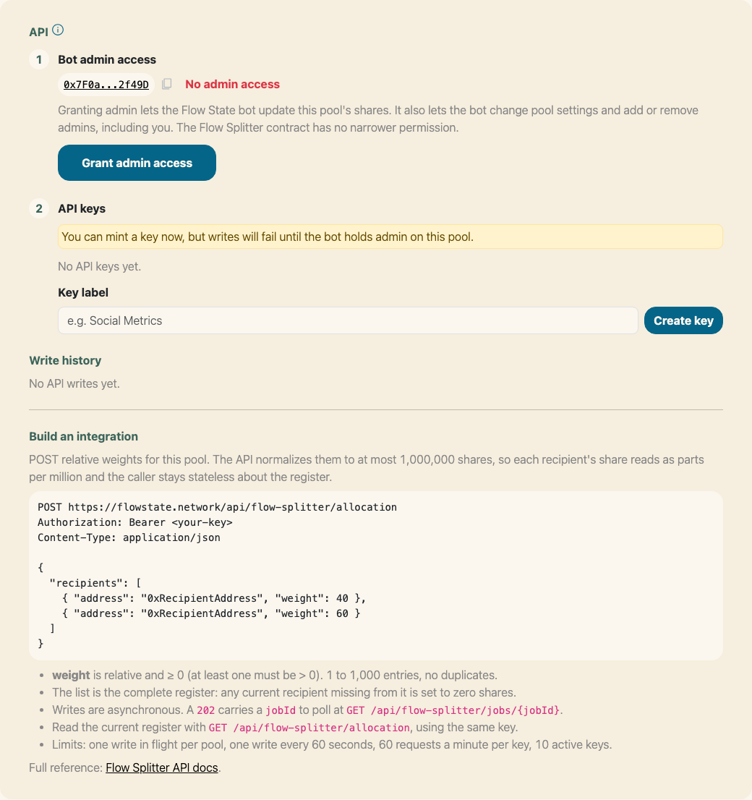
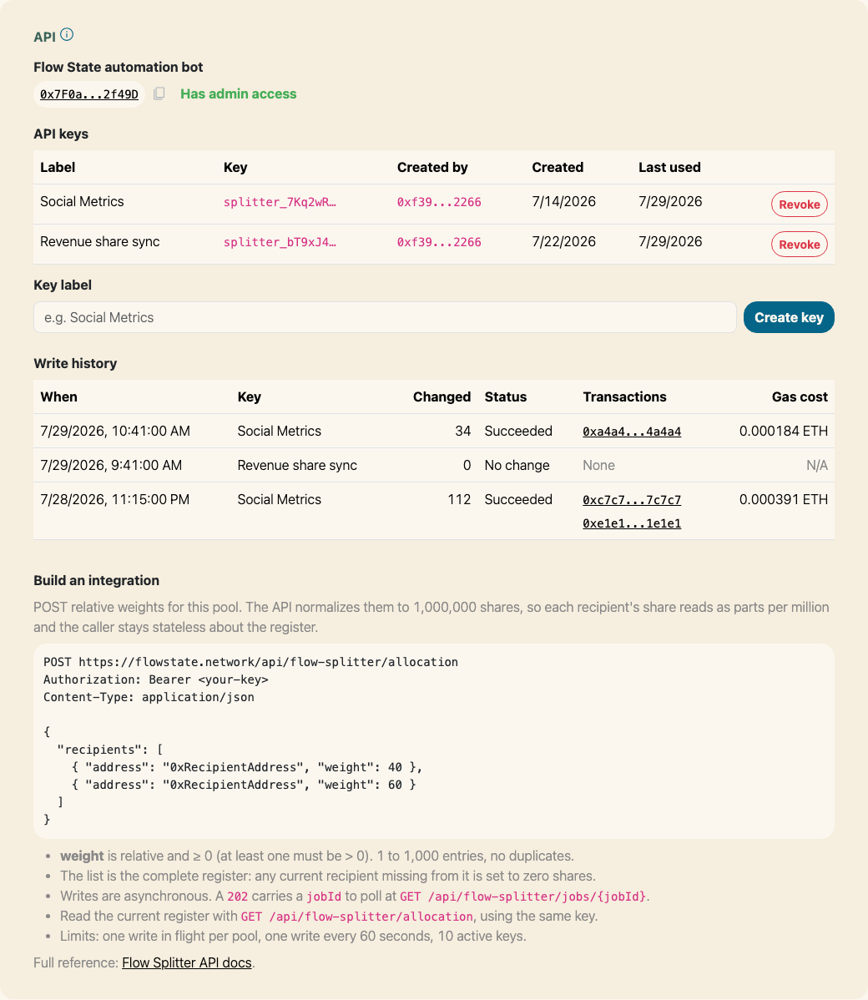
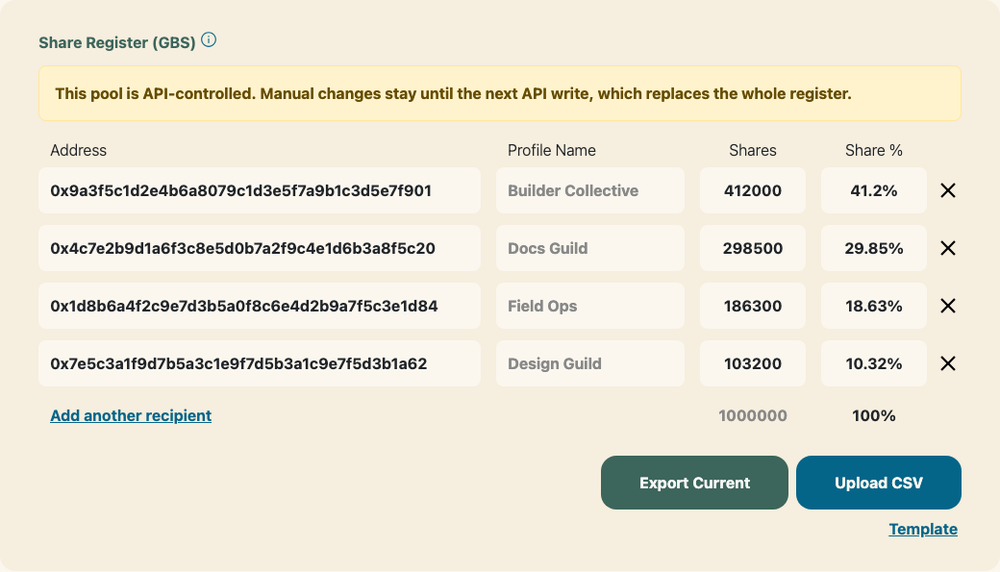
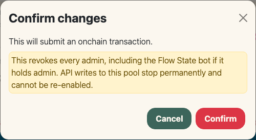

# Admin

As long as you have an Admin on the Flow Splitter, you can edit your Share Registry and Admins anytime.

Immutable Flow Splitters have their place, but we’re most excited about teams (which inherently evolve) earning/allocating streaming revenue and dynamic allocation use cases. If your split should follow live data instead of a hand-curated list, the [API](#api) lets an external system rewrite the Share Register for you.

You can navigate to [https://flowstate.network/flow-splitters](https://flowstate.network/flow-splitters) to see all the Flow Splitters you’re a part of—Admin or not.

## Profile Names

The Admins and Share Register tables each show a read-only **Profile Name** beside every address, so you can tell rows apart without decoding hex. Names resolve from Flow State's own known addresses first, then the address's Flow State profile, then ENS. An address with none of those reads **N/A**. The column isn't shown on small screens, where the rows already carry several controls.

## Visibility

A Flow Splitter is either **Listed** or **Unlisted**. Only Listed Splitters are meant for public discovery surfaces; Unlisted ones stay fully functional and remain accessible to anyone with a direct link. New Splitters default to Unlisted, so listing is opt-in. Admins can change visibility anytime from the admin page—the setting is stored in the pool's onchain metadata, so saving it is its own transaction.

## API

The **API** card at the bottom of the admin page lets an external system (a metrics job, a revenue feed, a cron script) replace the Share Register with no human signing anything. You post relative weights, the platform normalizes them, and the Flow State bot signs the onchain updates.

Everyone sees the endpoint reference and the current Share Register. Managing keys and granting the bot require you to hold Admin on the pool and to **Sign In With Ethereum** from the card.

:::warning[Two kinds of pool can never use the API]
A pool with **no admins** is permanently immutable, and a pool with **transferable shares** lets recipients move shares between writes, so the register the API believes it owns can be changed by someone else. Both are fixed at launch. The card hides everything but the explanation on those pools, and every API call is refused.
:::

### Grant the bot admin

*The API card before the bot has been granted admin.*

The card shows the Flow State bot's address and whether it currently holds Admin on this pool. **Grant admin access** adds the bot to the pool's admin set in a single transaction, and the status flips to **Has admin access** once it confirms. The bot then appears in your Admins table as *F(S) Automation Bot*.

:::warning[Admin is the only permission there is]
Granting admin lets the Flow State bot update this pool's shares. It also lets the bot change pool settings and add or remove admins, including you. The Flow Splitter contract has no narrower permission.
:::

You can mint keys before granting, but writes fail until the grant lands. If the bot loses admin later, writes stop with a clear error and your keys are left in place, so re-granting resumes the integration without re-keying.

### Create and revoke keys

*Keys and write history, once an integration is running.*

Give the key a label you'll recognize ("Social Metrics") and click **Create key**. The token is shown **once**, with a copy button. It is never stored in plaintext and can't be retrieved again; if you lose it, revoke the key and mint another.

The table lists each key by label and prefix, which admin created it, when it was created, and when it was last used. **Revoke** asks for a confirm, then blocks that key immediately. Revoking does not cancel a write that was already accepted. A pool can hold **10 active keys**; revoking one frees a slot.

A key carries the authority of the admin who minted it, so removing that admin from the pool stops their keys working. Mint from an account you intend to keep as an admin, and re-key from a current admin if you remove the one an integration depends on.

Hand the token to your external system and point it at the endpoints in **Build an integration** on the card. The full request format, limits, and error codes are in the [Flow Splitter API](../../developers/010-splitter-api.md) developer reference.

### Write history

Every API write is recorded: when it ran, which key sent it, how many recipients changed, the result, links to each transaction on the block explorer, and what it cost in gas. A resubmitted payload that changed nothing is listed as **No change** rather than as a write, and a **Failed** write names the transactions that did land. **Load more** pages back through older writes.

### Editing shares by hand

*The Share Register on a pool with an active API key.*

Manual editing stays enabled on an API-controlled pool, and the Share Register says what will happen to your edits. Each API write is a **full replacement**: whoever is missing from the payload is set to zero shares, so a hand-added recipient survives only until the next write.

### Turning an integration off

Revoking every key stops new writes. Removing the bot from the Admins table stops them too, and can be undone by granting again. Both are easy to do by accident while editing something else, so each takes an explicit confirm before the transaction is signed.

*The confirm shown before switching an API-controlled pool to No Admin.*

Switching the pool to **No Admin** is the permanent one: it revokes every admin, including the bot, and no key can ever be used on that pool again.
