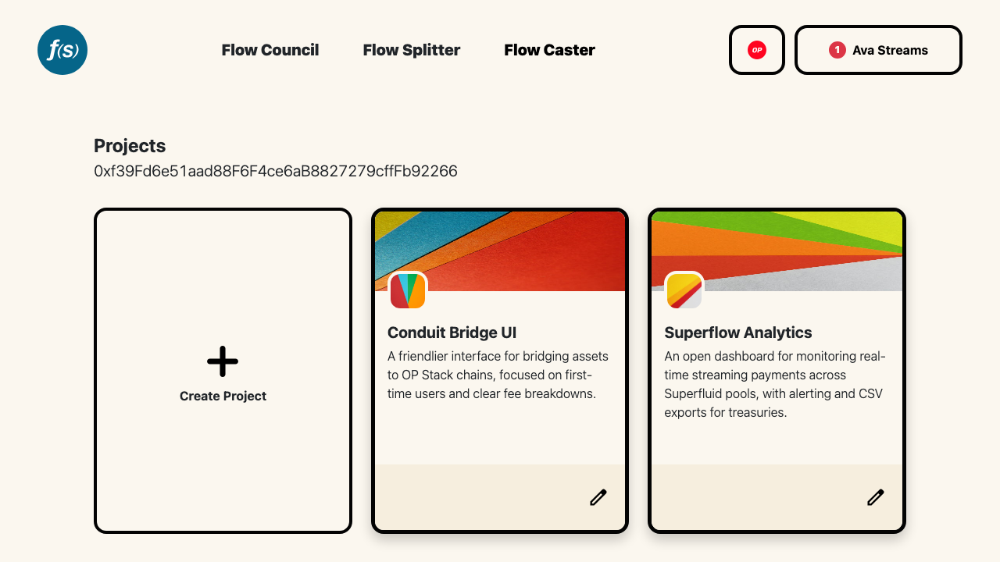
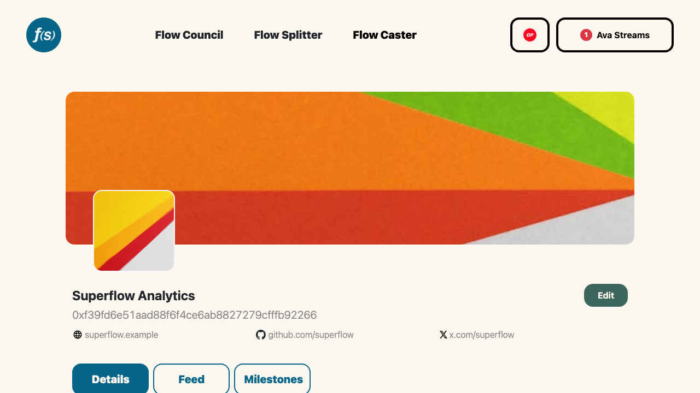

# Projects

A **project** is a reusable profile you create once and use to apply to Flow Councils and other rounds. Instead of re-entering your details for every application, you maintain a single project and reuse it everywhere.

Your projects live at [`flowstate.network/projects`](https://flowstate.network/projects). Each project also has its own public page at `flowstate.network/projects/<id>`.

## Creating a project

*Your projects.*

From the projects page, click **Create Project**. You'll be prompted to connect your wallet and **Sign In With Ethereum** if you haven't already, then a form opens with these sections:

- **Admin** — the **Project Name**, the **Manager Addresses** (every manager can edit the project; your signed-in address is locked as the primary manager), and a **Default Funding Address** (an EOA or Safe that receives ongoing funding outside of sponsored rounds).
- **Basics** — a **Description** (markdown supported), a square **Logo** (max 256KB), a 3:1 **Banner** (max 1MB), a **Website**, and an optional **Demo/Application Link**.
- **Social** — X/Twitter, Farcaster, Telegram Group, Discord Channel, Karma Profile, and a Gardens Pool link.
- **Technical** — **Github Repositories** and **Smart Contracts**.
- **Additional** — any **other links** you want to share.

Click **Save Project** to publish. The same form is used to edit later.

:::note
Editing is only available to a project manager. If you're not signed in with a manager address, the project page is read-only and the **Edit** button is hidden.
:::

## The project page

*A project page with its links and tabs.*

Each project page shows the banner, logo, name, manager address, and your linked website and social profiles, followed by three tabs:

- **Details** — your project description, rendered from markdown.
- **Feed** — an activity feed of posts and updates. Managers can write posts here; this is the same channel used for project communications in Flow Councils.
- **Milestones** — milestone progress reported against the rounds you've applied to. See [Milestones](001-milestones.md).

## Receiving funding

A project page can also accept funding directly, shown alongside the **Details** tab when configured.

### Direct Funding

If your project sets a **Default Funding Address**, anyone can open a real-time stream straight to it from the **Fund Project** widget. They pick a network and a [Super Token](https://docs.superfluid.finance/docs/concepts/overview/super-tokens), set a monthly rate, and start a [stream](https://docs.superfluid.finance/docs/concepts/overview/money-streaming) — no round required.

### Gardens Pool Funding

If your project links a **Gardens Pool**, a **Fund Gardens Pool** widget lets supporters stream into your [Gardens Protocol](https://gardens.fund) pool the same way, with a link out to the pool on Gardens.

:::tip[Keep a positive balance]
Streams stay open only while the sender holds a positive Super Token balance. The funding widget shows an estimated liquidation date — wrap or top up tokens before then to avoid your stream being cancelled.
:::
